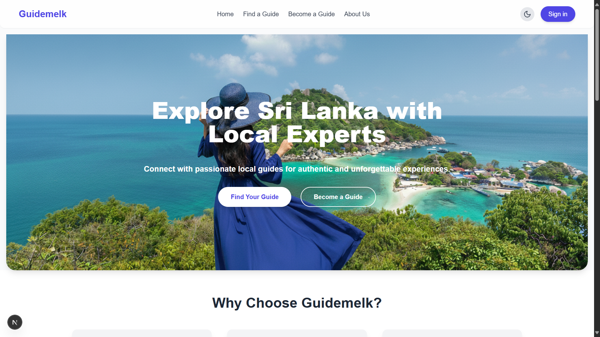
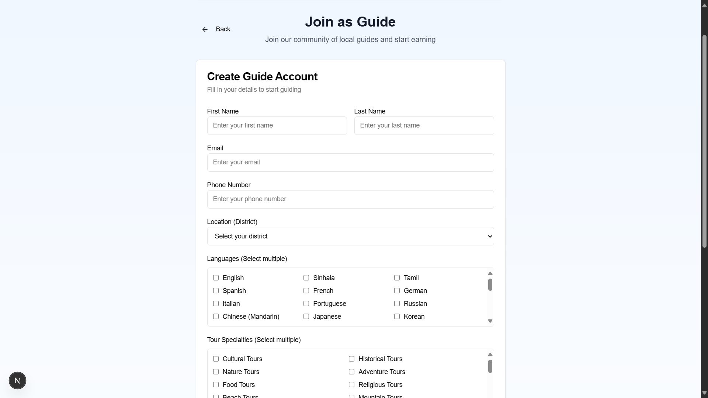
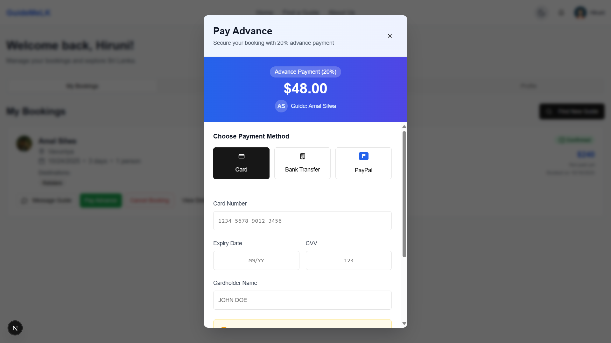
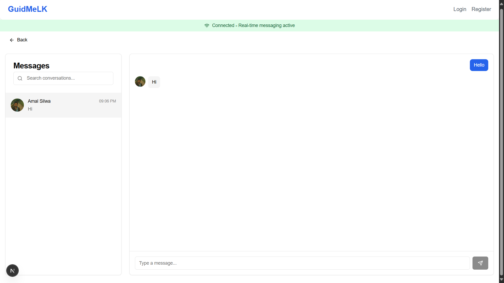

<p align="center">
  
</p>

<p align="center">
  <strong>A digital platform that connects tourists with local guides in Sri Lanka.</strong><br />
  Built to promote sustainable tourism, authentic travel experiences, and empower local guides.
</p>

---


---

## 📚 Project Overview

**GuidMeLK** is a responsive web platform designed to directly connect **tourists** with **local tour guides** in Sri Lanka. Tourists can search, compare, and book guides based on **destination, language, price, and reviews**, while guides can showcase their services and availability. 

The platform also supports **real-time chat, secure payments, and ratings/reviews**, helping to build trust and promote sustainable tourism.

This project is developed as part of the **Independent Study Project I** for the ICT degree program at **Uva Wellassa University of Sri Lanka (2022/2023 Batch)**.

---

## 🚀 Key Features

- **🔐 User Authentication & Roles**
  - Email/password login with JWT
  - Google Sign-in with NextAuth
  - Email verification via Nodemailer
  - Role-based dashboards: **Tourist / Guide / Admin**

- **👤 Profile Management**
  - Tourists: update personal info, preferences
  - Guides: showcase services, pricing, languages, availability
  - Admin: monitor users, disputes, and reports

- **💬 Real-time Messaging**
  - Built with **Socket.IO**
  - One-to-one and one-to-many chat between tourists and guides
  - Seen/delivered indicators

- **📅 Booking System**
  - Tourists can book guides directly
  - Advance payment (20%) and remaining balance handling
  - Guide availability management

- **💳 Payments (Planned)**
  - Support for **Card, Bank Transfer, and PayPal** 
  - Records stored in MongoDB (`payments` collection)
  - Advance vs. Remaining payment logic

- **⭐ Reviews & Ratings**
  - Tourists can review guides after trips
  - Rating system to highlight top guides

- **🔔 Notifications**
  - New booking alerts
  - Payment confirmations
  - Review & rating updates

- **🛡️ Admin Dashboard**
  - Manage users, bookings, disputes
  - Monitor transactions
  - Oversee platform activity

---

## 🛠️ Tech Stack

| Layer               | Technology                                   |
| ------------------- | -------------------------------------------- |
| **Frontend**        | Next.js (React), Tailwind CSS                |
| **Backend**         | Next.js API routes (Node.js)                 |
| **Database**        | MongoDB                                     |
| **Auth**            | JWT, NextAuth (Google Sign-in)              |
| **Email**           | Nodemailer (for email verification)         |
| **Messaging**       | Socket.IO                                   |
| **Version Control** | Git + GitHub                                |
| **Design**          | Figma & Canva                               |

---

## 🏗️ System Development Approach

The project follows the **Waterfall model**, with phases for requirement gathering, design, implementation, testing, and deployment. Each step is completed before moving to the next, ensuring a structured development flow.

---

## ⚙️ Setup & Installation

Follow these steps to run **GuidMeLK** locally on your computer:

### 1. Clone the Repository
```bash
git clone https://github.com/chamod-malindu/guidemelk-web-project.git
cd guidemelk-web-project
```

### 2. Install dependencies
```bash
npm install
```

### 3. Create a .env.local File
```
MONGODB_URI=your_mongodb_connection_string

JWT_SECRET=guidemelkdb12345

EMAIL_USER=your_email@example.com
EMAIL_PASS=your_email_password
NEXT_PUBLIC_BASE_URL=http://localhost:3000 

GOOGLE_CLIENT_ID=your_google_client_id
GOOGLE_CLIENT_SECRET=your_google_client_secret
NEXTAUTH_SECRET=your_nextauth_secret
NEXTAUTH_URL=http://localhost:3000
```

### 4. Run the Development Server
```bash
npm run dev
```

---

## 👥 Team Members

Meet the development team behind **GuidMeLK** (Group 08 – UWU/ICT/22):

| Name                  | Role                                      | GitHub                                   | LinkedIn                                                   |
| --------------------- | ----------------------------------------- | ---------------------------------------- | ---------------------------------------------------------- |
| **Chamod Malindu**    | Full Stack Developer & Planning            | [@chamod-malindu](https://github.com/chamod-malindu)    | [Chamod Kariyawasam](https://www.linkedin.com/in/chamod-kariyawasam-7724b1311)  |
| **Poojani Ranasinghe**| Frontend Developer & Designer              | [@PoojaniRanasinghe](https://github.com/PoojaniRanasinghe) | [Poojani Ranasinghe](http://www.linkedin.com/in/poojani-ranasinghe-184770310)  |
| **Chamodi Aponsu**    | Project Management & Development Support   | [@ChamodiAponsu](https://github.com/ChamodiAponsu)       | [Chamodi Aponsu](https://www.linkedin.com/in/chamodi-aponsu-167410307)  |
| **Thisara Randima**   | UI/UX Designer                             | —                                            | [Thisara Randima](https://www.linkedin.com/in/thisara-randima-44476735a/)  |
| **Hiruni Pamudika**   | Documentation & Quality Assurance (QA)     | [@hiruni7](https://github.com/hiruni7)   | [Hiruni Pamudika](https://www.linkedin.com/in/hiruni-pramudika-4148a637b)  |

---  

## 💡 Why We Built This

Sri Lanka’s tourism industry contributes significantly to the economy, yet **tourists struggle to directly connect with reliable local guides**. Existing platforms mainly highlight travel agencies rather than freelance guides. GuidMeLK aims to:

- Empower local guides with a direct digital platform
- Help tourists find authentic, cultural travel experiences
- Promote **sustainable tourism** by supporting local talent
- Build trust through reviews, ratings, and secure payments

---

## 🔮 Future Enhancements

To continue improving GuidMeLK, we plan to introduce the following features in future versions:

- **💳 Complete Payment Gateway Integration**  
  Enable real-time secure transactions via **PayPal, Stripe, and direct bank transfers**, allowing tourists to pay guides safely within the platform.

- **📱 Mobile App Version**  
  Develop a **cross-platform mobile app** using React Native or Flutter for a more accessible travel experience.

- **🌍 Multi-language Support**  
  Introduce multi-language options to make the platform more inclusive for international tourists.

- **🧭 AI-based Guide Recommendations**  
  Implement AI algorithms to recommend guides based on user preferences, past trips, and ratings.

- **📢 Advanced Notification System**  
  Add push notifications and real-time alerts for bookings, messages, and payment confirmations.

- **🧾 Admin Analytics Dashboard**  
  Provide real-time insights for administrators with data visualizations on user engagement, bookings, and transactions.

---

## 🏁 Conclusion

**GuidMeLK** serves as a bridge between **tourists** and **local guides**, fostering trust, convenience, and sustainable tourism in Sri Lanka.  
Through its innovative features — from real-time communication to verified profiles — the platform helps tourists enjoy authentic experiences while empowering local guides with new opportunities.  

---

## 🖼️ Project Screenshots

### 🏠 Landing Page
<p align="center">
  
</p>

### 🧭 Guide Registration Form
<p align="center">
  
</p>

### 💳 Payment Options
<p align="center">
  
</p>

### 💬 Chat Page
<p align="center">
  
</p>

> ⭐ If you find this project useful or inspiring, please consider starring the repo and following our journey. Thank you!

